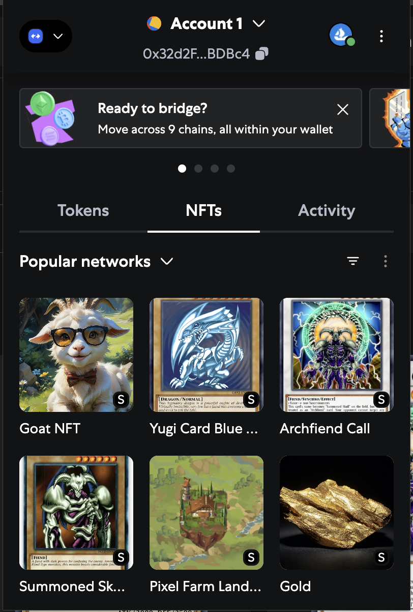
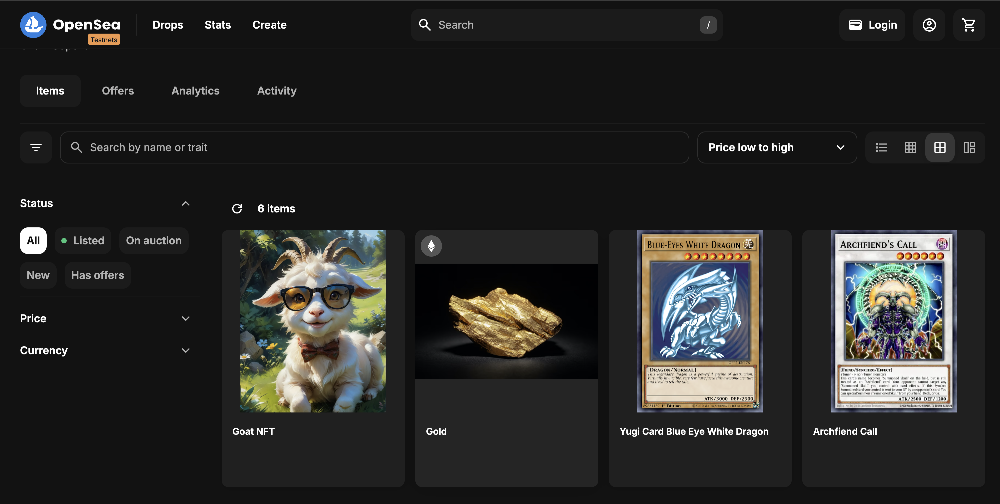
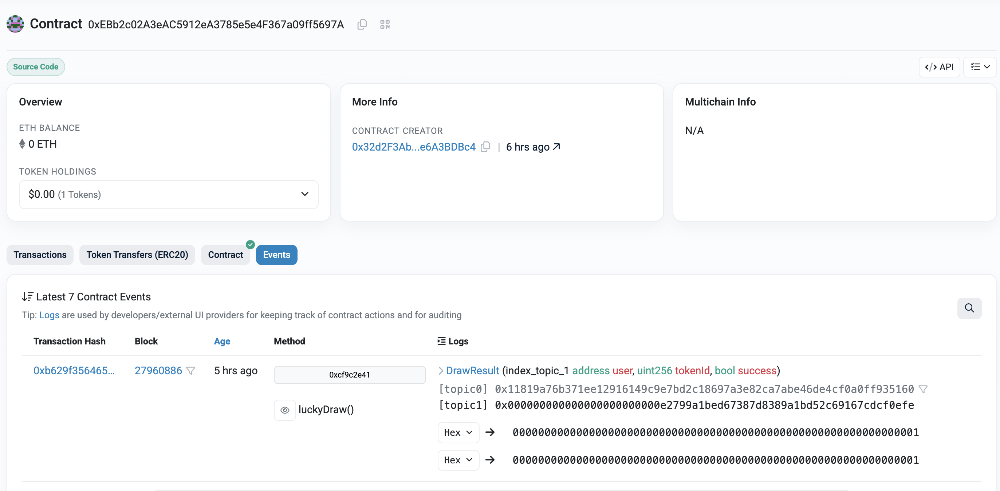
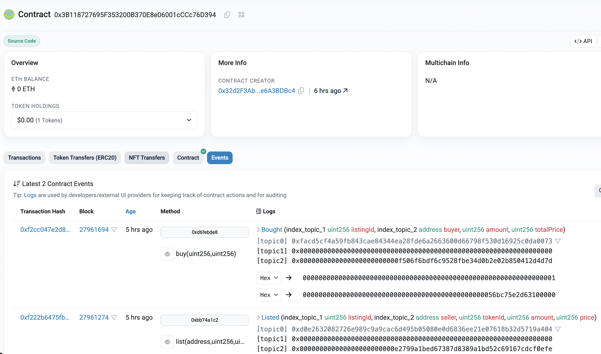

# 🧪 KaiNFT On-chain Demo

This document showcases how the KaiNFT system works live on-chain across three components:

- `KaiNftToken` — ERC-1155 NFT contract
- `KaiGacha` — Lucky draw mechanic (uses KaiToken)
- `KaiMarketplace1155` — Marketplace for listing & buying NFTs with KaiToken

> All contracts are deployed on **Sepolia Optimism Testnet**  
> 👉 You can verify, inspect, and simulate transactions via Etherscan links and screenshots below.

---

## 🧱 1. KaiNftToken — ERC-1155 NFT Contract

Minted NFTs with unique `tokenId`, URI stored on IPFS.

- ✅ Mint controlled by admin
- ✅ Token URI points to metadata hosted on IPFS
- ✅ Both NFTs and semi-fungible tokens are supported

🔗 **Kai NFT Token**  
- [View on Etherscan](https://sepolia-optimism.etherscan.io/address/0xA2555F09b2aCC3EabD2feee5e2AC36b5Da066e61)
- [IPFS Metadata Example](https://red-secure-wallaby-951.mypinata.cloud/ipfs/bafkreib7hw4u6nnjngy5kfikhw2lv33kxmv2nn5fl4ii63xppy6kjq2yr4)

📸 **Screenshot**
- NFTs can show in metamask

- NFTs also can see in OpenSea Testnet

---

## 🎲 2. KaiGacha — Lucky Draw Mechanic

Users can spend KaiToken to draw for a chance to win NFTs.

- 🎯 Pseudo-random reward with preset chances
- 🔐 On-chain randomness via `blockhash + timestamp`
- 💸 Uses `transferFrom` to collect KaiToken from player
- 🎁 Emits `DrawResult` and `DrawFailed` events

🔗 **Example Draw TX**  
- [Lucky Draw Transaction](https://sepolia-optimism.etherscan.io/address/0xEBb2c02A3eAC5912eA3785e5e4F367a09ff5697A)

📸 **Screenshot**  

---

## 🛒 3. KaiMarketplace1155 — NFT Marketplace

Allows users to list, buy, and cancel NFT listings. Built for ERC-1155.

- ✅ Seller lists NFT → contract holds NFT in escrow
- ✅ Buyer purchases via KaiToken (ERC-20)
- 🔄 Fee taken from sale and sent to `feeRecipient`
- 🛡️ Secured with `ReentrancyGuard` and `ERC1155Receiver`

🔗 **Example Buy TX**  
- [Marketplace Transaction](https://sepolia-optimism.etherscan.io/address/0x3B118727695F353200B370E8e06001cCCc76D394)

📸 **Screenshots**  
- Listing NFT  && Successful Purchase
  

---

## 🔗 Contract Addresses

- On Sepolia Optimism

| Contract            | Address                             |
|---------------------|-------------------------------------|
| KaiNftToken         | `0xA2555F09b2aCC3EabD2feee5e2AC36b5Da066e61`          |
| KaiToken (ERC20)    | `0xA519c8Eb34EcF230894C23958e4e8BA2aa45D690`             |
| KaiGacha            | `0xEBb2c02A3eAC5912eA3785e5e4F367a09ff5697A`             |
| KaiMarketplace1155  | `0x3B118727695F353200B370E8e06001cCCc76D394`       |

- On Sepolia

| Contract            | Address                             |
|---------------------|-------------------------------------|
| KaiNftToken         | `0x4Fb7619c7BDE8Dd4fd308A6CfC6a794e1327Ea6F`          |
| KaiToken (ERC20)    | `0x7D98DF6357b07A3c0deDF849fD829f7296b818F5`             |
| KaiGacha            | `0x7AAbA50Cd2e32E23506c162094fD47849fBDC0AF`             |
| KaiMarketplace1155  | `0x7D98DF6357b07A3c0deDF849fD829f7296b818F5`       |
---

## 📘 Notes

- All metadata is hosted on IPFS (via Pinata)
- Subgraph is deployed for real-time query (The Graph)
- Tests are written in TypeScript with Hardhat
- This is a backend/protocol-level implementation — frontend in progress

---

🧠 Want to try drawing or listing an NFT? Ask for a Sepolia Optimism faucet & KaiToken from the team.
